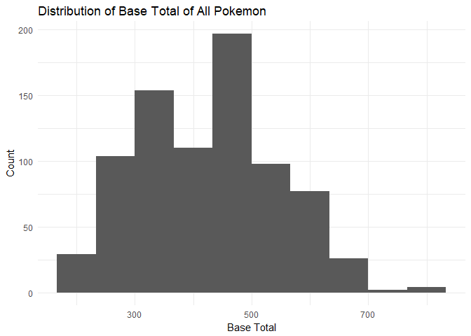

Classifying Legendary pokemon
================
Hubert Luo
May 24, 2018

``` r
library(dplyr)
library(ggplot2)
```

Introduction
------------

A legendary Pokémon is a rare Pokémon that has a number of distinguishing features - it is usually powerful, hard to capture, and gains experience slowly. With these factors in mind, we develop a classifier to predict whether a given Pokémon is legendary or not.


Data
----

The data used consists of all 801 Pokémon from the National Pokédex (Generations I-VII) consisted of 6 variables:

1.  **Name of Pokémon:** String vector of English name of Pokémon
2.  **Pokédex Number:** Unique number between 1 and 801 inclusive for each Pokémon
3.  **Base Total:** Number that measures how powerful we consider a Pokémon to be. It is the sum of a Pokémon's HP, Attack, Special Attack, Defense, Special Defense, and Speed ratings so Pokémon with higher base totals are more powerful. The base total ranges from 180 to 780, with most legendary Pokémon having high base totals of at least 600
4.  **Capture Rate:** Number that measures how difficult it is to catch a Pokémon, Pokémon with higher capture rates are easier to capture. The Capture Rate ranges from 3 to 255, with most legendary Pokémon having low capture rates of less than 5.
5.  **Experience Growth:** Number that contains the number of experience points a Pokémon will have at level 100, so those with higher values of experience growth will level up slower. Most legendary Pokémon gain experience slowly and will have about 1.25 million experience points at level 100.
6.  **Legendary:** A binary number that states whether a Pokémon is legendary or not. 0 means a Pokémon is not legendary, while a 1 means a Pokémon is legendary. This is used when training the data and to evaluate the accuracy of our model on our testing data.

The first 3 rows of the original data are displayed below, with a histogram of the distribution of the base total among all Pokémon.

``` r
pokemon = read.csv('Pokemon.csv', stringsAsFactors = FALSE)
pokemon = pokemon %>% select(name, pokedex_number, base_total, capture_rate, experience_growth, is_legendary)
non_standardized_pokemon = pokemon

head(non_standardized_pokemon, 3)
```

    ##        name pokedex_number base_total capture_rate experience_growth
    ## 1 Bulbasaur              1        318           45           1059860
    ## 2   Ivysaur              2        405           45           1059860
    ## 3  Venusaur              3        625           45           1059860
    ##   is_legendary
    ## 1            0
    ## 2            0
    ## 3            0

``` r
ggplot(data = non_standardized_pokemon) +
  geom_histogram(aes(x = base_total), bins = 10) + 
  ggtitle('Distribution of Base Total of All pokemon') + 
  labs(x = 'Base Total', y = 'Count') +
  theme_minimal()
```



Data Wrangling
--------------

In order to use the data in the classifier, we normalized the data as they all follow different scales. The first 3 rows of the normalized data are displayed below.

``` r
normalize_feature <- function(x){
  x = as.integer(x)
  (x-mean(x,na.rm = TRUE))/sd(x, na.rm = TRUE)
}
for (i in 3:5){
  pokemon[,i] = normalize_feature(pokemon[,i]) 
}
head(pokemon, 3)
```

    ##        name pokedex_number base_total capture_rate experience_growth
    ## 1 Bulbasaur              1 -0.9259540   -0.7049932        0.03035206
    ## 2   Ivysaur              2 -0.1961101   -0.7049932        0.03035206
    ## 3  Venusaur              3  1.6494721   -0.7049932        0.03035206
    ##   is_legendary
    ## 1            0
    ## 2            0
    ## 3            0

Because Minior (Pokédex Number 774) has different capture rates of 30 in meteorite form and 255 in core form, we decided to remove it from the dataset (note that it's capture rate is a missing value in the dataset)

``` r
pokemon = pokemon %>% filter(!is.na(capture_rate))
```

Then, we randomly divide the data into testing and training sets using an 80-20 split, with 80% of the data going in the training set and 20% in the testing set. The following shows the first 3 rows of the training and test sets respectively.

``` r
n = nrow(pokemon)
set.seed(123)
training_indices = sort(sample(1:n, size = round(0.8*n), replace = FALSE))
testing_indices = numeric()
for (i in 1:n){
  if (!(i %in% training_indices)){
    testing_indices = c(testing_indices, i)
  }
}
training = pokemon[training_indices,]
testing = pokemon[testing_indices,] 

head(training, 3)
```

    ##         name pokedex_number base_total capture_rate experience_growth
    ## 1  Bulbasaur              1 -0.9259540   -0.7049932        0.03035206
    ## 4 Charmander              4 -1.0014551   -0.7049932        0.03035206
    ## 5 Charmeleon              5 -0.1961101   -0.7049932        0.03035206
    ##   is_legendary
    ## 1            0
    ## 4            0
    ## 5            0

``` r
head(testing, 3)
```

    ##        name pokedex_number base_total capture_rate experience_growth
    ## 2   Ivysaur              2 -0.1961101   -0.7049932        0.03035206
    ## 3  Venusaur              3  1.6494721   -0.7049932        0.03035206
    ## 6 Charizard              6  1.7249732   -0.7049932        0.03035206
    ##   is_legendary
    ## 2            0
    ## 3            0
    ## 6            0

Classifying Data
----------------

In order to evaluate how similar two data points are across the three features of base total, capture rate, and experience growth we use the Euclidian distance metric, as implemented below.

``` r
#' @title distance
#' @description Find distance between two points (pokemon) in 3 features
#' @param train_row A row in the training set
#' @param test_row A row in the testing set
#' @return The Euclidian distance between the two points in the 3 features selected
distance <- function(train_row = training[1,], test_row = testing[1,]){
  total = 0
  for (i in 3:5){
    total = total + (test_row[,i] - train_row[,i])^2
  }
  return(sqrt(total))
}
```

Finally, we will find the 3 closest points in the training set to a given Pokémon in the testing set and see whether the majority of them are legendary Pokémon or not. If the majority of its 3 nearest neighbours are legendary, then we will predict the Pokémon will be legendary, and similar for not legendary.

``` r
#' @title classify
#' @description Predict whether a pokemon in the testing set will be legendary or not by looking at its 3 nearest neighbours in the training set
#' @param x A row in the testing set to predict
#' @return Whether a pokemon is predicted to be legendary (1) or not (0)
classify <- function(x){
  closest = training %>% mutate('Distance' = distance(training, x)) %>% arrange(Distance) %>% slice(1:3) # Select 3 closest pokemon in training set
  names(which.max(table(closest$is_legendary)))
}
```

For example, we can correctly predict that Mew, a Pokémon in the testing set, is legendary.

``` r
classify(testing[testing$name=='Mew',])
```

    ## [1] "1"

Finally, we apply our function to all the Pokémon in the testing set as follows in the dataframe predicted\_testing below.

``` r
predicted_class = numeric()
for(i in 1:nrow(testing)){
  predicted_class = c(predicted_class, classify(testing[i,]))
}
predicted_testing = testing %>% mutate('predicted_legendary' = predicted_class) 
```

The accuracy of our model can be determined by seeing how many of the Pokémon in the dataframe have the same predicted and actual legendary status.

``` r
accuracy = sum(predicted_testing$is_legendary == predicted_testing$predicted_legendary)/nrow(predicted_testing)
accuracy
```

    ## [1] 0.9875

Note that this accuracy **only** accounts for Pokémon in the testing set - if we include the Pokémon in the training set, we get an inflated accuracy as Pokémon in the training set will be more likely to be predicted correctly as there automatically is one correct point (itself) among its closest neighbours!
